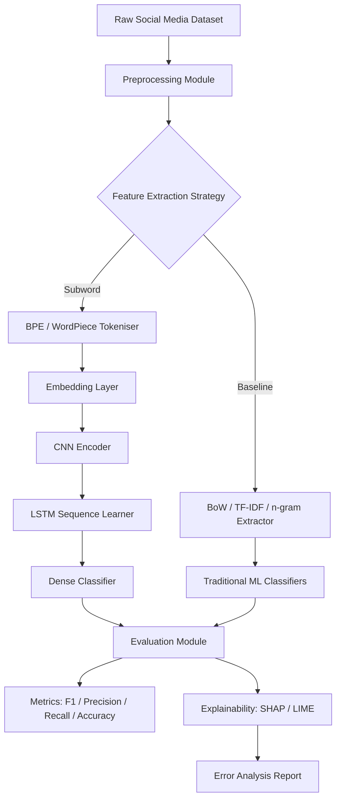
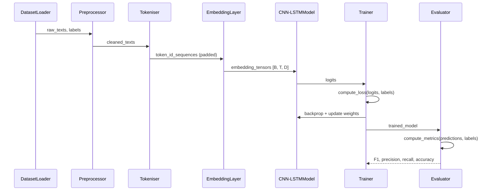
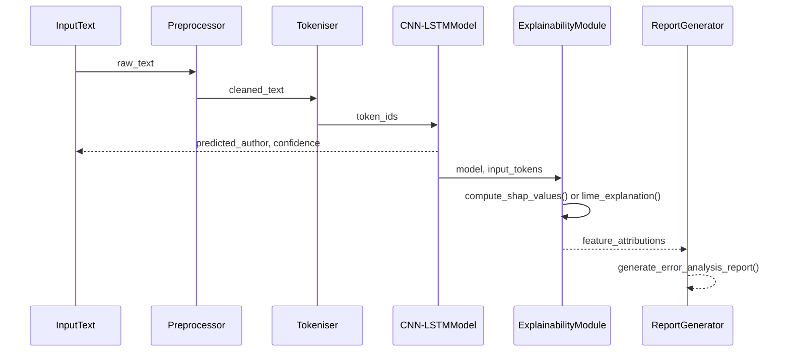

# Design Document: Neural Authorship Attribution with Subword Embeddings and CNN-LSTM

## Overview

This project investigates neural authorship attribution using subword embedding techniques combined with a CNN-LSTM architecture. The system learns author-specific stylometric representations from subword tokenised text and classifies documents to their authors, comparing this approach against traditional baselines (BoW, TF-IDF, character n-grams, word n-grams) on a social media dataset.

The core hypothesis is that subword embeddings (BPE/WordPiece) capture morphological and stylistic patterns at a finer granularity than word-level features, enabling the CNN-LSTM encoder to learn richer author fingerprints. Explainability via SHAP/LIME is integrated to interpret model decisions and analyse misclassifications.

The pipeline covers: data ingestion → preprocessing → feature extraction (subword vs. baseline) → model training (CNN-LSTM vs. baselines) → evaluation (F1, precision, recall, accuracy, robustness) → explainability analysis.

## Architecture




## Sequence Diagrams

### Training Flow



### Inference + Explainability Flow




## Components and Interfaces

### Component 1: DatasetLoader

**Purpose**: Load and split the social media authorship attribution dataset into train/validation/test partitions.

**Interface**:
```python
class DatasetLoader:
    def load(self, path: str) -> tuple[list[str], list[int]]:
        """Returns (texts, author_labels) from CSV/JSON dataset file."""

    def split(
        self,
        texts: list[str],
        labels: list[int],
        train_ratio: float = 0.7,
        val_ratio: float = 0.15,
        seed: int = 42
    ) -> tuple[Split, Split, Split]:
        """Stratified split into train/val/test. Returns (train, val, test) Split namedtuples."""
```

**Responsibilities**:
- Read dataset from disk (CSV or JSON)
- Map author names to integer label indices
- Perform stratified splitting to preserve class distribution
- Expose dataset statistics (num_authors, samples_per_author)

---

### Component 2: Preprocessor

**Purpose**: Clean and normalise raw social media text before tokenisation.

**Interface**:
```python
class Preprocessor:
    def clean(self, text: str) -> str:
        """Remove URLs, mentions, special chars; normalise whitespace; lowercase."""

    def batch_clean(self, texts: list[str]) -> list[str]:
        """Apply clean() to a list of texts."""
```

**Responsibilities**:
- Strip URLs, @mentions, #hashtags (configurable — some stylometric signals live in hashtag usage)
- Normalise Unicode, handle emoji (keep or strip, configurable)
- Preserve punctuation patterns that carry stylometric signal

---

### Component 3: SubwordTokeniser

**Purpose**: Tokenise text into subword units using BPE or WordPiece and map to integer IDs.

**Interface**:
```python
class SubwordTokeniser:
    def train(self, texts: list[str], vocab_size: int = 10000, algorithm: str = "bpe") -> None:
        """Train tokeniser vocabulary on corpus. algorithm in {"bpe", "wordpiece"}."""

    def encode(self, text: str, max_length: int = 256) -> list[int]:
        """Encode text to padded/truncated token ID sequence."""

    def batch_encode(self, texts: list[str], max_length: int = 256) -> np.ndarray:
        """Returns array of shape [N, max_length]."""

    def decode(self, ids: list[int]) -> str:
        """Decode token IDs back to text (for explainability)."""

    def vocab_size(self) -> int: ...
```

**Responsibilities**:
- Train BPE or WordPiece vocabulary from scratch on the dataset corpus
- Handle padding (`[PAD]`) and truncation to `max_length`
- Persist trained vocabulary to disk for reproducibility

---

### Component 4: BaselineFeatureExtractor

**Purpose**: Extract traditional features for baseline comparison models.

**Interface**:
```python
class BaselineFeatureExtractor:
    def fit_transform(self, texts: list[str], method: str) -> scipy.sparse.csr_matrix:
        """
        method in {"bow", "tfidf", "char_ngram", "word_ngram"}.
        Fits on texts and returns feature matrix [N, F].
        """

    def transform(self, texts: list[str]) -> scipy.sparse.csr_matrix:
        """Transform unseen texts using fitted vocabulary."""
```

**Responsibilities**:
- Wrap scikit-learn `CountVectorizer` (BoW), `TfidfVectorizer` (TF-IDF)
- Support character n-gram range (e.g., 2–5) and word n-gram range (e.g., 1–3)
- Consistent interface so baseline classifiers (SVM, LogReg) plug in uniformly

---

### Component 5: CNNLSTMModel

**Purpose**: The primary deep learning model — CNN extracts local n-gram features from embeddings, LSTM captures sequential dependencies, dense head classifies authors.

**Interface**:
```python
class CNNLSTMModel(nn.Module):
    def __init__(
        self,
        vocab_size: int,
        embed_dim: int,
        num_filters: int,
        kernel_sizes: list[int],
        lstm_hidden: int,
        lstm_layers: int,
        num_classes: int,
        dropout: float
    ) -> None: ...

    def forward(self, token_ids: Tensor) -> Tensor:
        """
        Input:  token_ids  [B, T]  (batch x sequence length)
        Output: logits     [B, C]  (batch x num_authors)
        """
```

**Responsibilities**:
- Learnable embedding lookup: `[B, T] → [B, T, D]`
- Parallel CNN filters over kernel sizes (e.g., 2, 3, 4) with max-over-time pooling
- Concatenated CNN features fed into stacked LSTM
- Dropout regularisation at embedding and pre-classifier layers
- Output raw logits (CrossEntropyLoss applied externally)

---

### Component 6: Trainer

**Purpose**: Manage the training loop, validation, early stopping, and checkpoint saving.

**Interface**:
```python
class Trainer:
    def train(
        self,
        model: nn.Module,
        train_loader: DataLoader,
        val_loader: DataLoader,
        epochs: int,
        lr: float,
        patience: int
    ) -> TrainingHistory: ...

    def evaluate(self, model: nn.Module, loader: DataLoader) -> MetricsDict: ...
```

**Responsibilities**:
- Adam optimiser with learning rate scheduling
- Early stopping on validation F1 (macro)
- Save best checkpoint by validation F1
- Log per-epoch loss and metrics

---

### Component 7: ExplainabilityModule

**Purpose**: Generate SHAP or LIME explanations for model predictions to support error analysis.

**Interface**:
```python
class ExplainabilityModule:
    def explain_shap(
        self,
        model: nn.Module,
        tokeniser: SubwordTokeniser,
        texts: list[str],
        background_texts: list[str]
    ) -> list[ShapExplanation]: ...

    def explain_lime(
        self,
        model: nn.Module,
        tokeniser: SubwordTokeniser,
        text: str,
        num_samples: int = 500
    ) -> LimeExplanation: ...

    def error_analysis(
        self,
        explanations: list[ShapExplanation | LimeExplanation],
        predictions: list[int],
        labels: list[int]
    ) -> ErrorAnalysisReport: ...
```

**Responsibilities**:
- Use `shap.DeepExplainer` or `shap.KernelExplainer` for token-level attributions
- Use `lime.lime_text.LimeTextExplainer` for local surrogate explanations
- Aggregate attributions over misclassified samples to surface systematic failure patterns


## Data Models

### AuthorDataset

```python
@dataclass
class AuthorSample:
    text: str           # raw post/message text
    author_id: int      # integer label (0-indexed)
    author_name: str    # original author string
    source: str         # dataset split: "train" | "val" | "test"

@dataclass
class Split:
    texts: list[str]
    labels: list[int]
    author_map: dict[int, str]   # id → name mapping
```

**Validation Rules**:
- `text` must be non-empty after preprocessing
- `author_id` must be in range `[0, num_authors)`
- Each split must contain at least one sample per author class

---

### ModelConfig

```python
@dataclass
class ModelConfig:
    vocab_size: int        # subword vocabulary size (default: 10_000)
    embed_dim: int         # embedding dimension (default: 128)
    num_filters: int       # CNN filters per kernel size (default: 128)
    kernel_sizes: list[int]  # CNN kernel sizes (default: [2, 3, 4])
    lstm_hidden: int       # LSTM hidden units (default: 256)
    lstm_layers: int       # stacked LSTM layers (default: 2)
    dropout: float         # dropout rate (default: 0.5)
    max_seq_len: int       # max token sequence length (default: 256)
    num_classes: int       # number of authors
```

---

### TrainingConfig

```python
@dataclass
class TrainingConfig:
    epochs: int            # max training epochs (default: 50)
    batch_size: int        # mini-batch size (default: 64)
    learning_rate: float   # Adam LR (default: 1e-3)
    patience: int          # early stopping patience (default: 5)
    seed: int              # random seed for reproducibility (default: 42)
    device: str            # "cuda" | "cpu"
```

---

### MetricsDict

```python
@dataclass
class MetricsDict:
    accuracy: float
    precision_macro: float
    recall_macro: float
    f1_macro: float
    f1_per_class: dict[int, float]   # per-author F1
    confusion_matrix: np.ndarray     # [C, C]
```


## Algorithmic Pseudocode

### Main Training Algorithm

```pascal
ALGORITHM train_cnn_lstm(dataset_path, model_config, train_config)
INPUT:  dataset_path   : path to social media dataset
        model_config   : ModelConfig
        train_config   : TrainingConfig
OUTPUT: best_model     : trained CNN-LSTM
        history        : TrainingHistory

BEGIN
  SET seed(train_config.seed)

  // Phase 1: Data preparation
  loader   ← DatasetLoader()
  texts, labels ← loader.load(dataset_path)
  train, val, test ← loader.split(texts, labels, 0.70, 0.15)

  preprocessor ← Preprocessor()
  train.texts ← preprocessor.batch_clean(train.texts)
  val.texts   ← preprocessor.batch_clean(val.texts)
  test.texts  ← preprocessor.batch_clean(test.texts)

  // Phase 2: Subword tokenisation
  tokeniser ← SubwordTokeniser()
  tokeniser.train(train.texts, vocab_size=model_config.vocab_size, algorithm="bpe")
  
  X_train ← tokeniser.batch_encode(train.texts, model_config.max_seq_len)
  X_val   ← tokeniser.batch_encode(val.texts,   model_config.max_seq_len)
  X_test  ← tokeniser.batch_encode(test.texts,  model_config.max_seq_len)

  // Phase 3: Model initialisation
  model ← CNNLSTMModel(model_config)
  optimiser ← Adam(model.parameters(), lr=train_config.learning_rate)
  scheduler ← ReduceLROnPlateau(optimiser, patience=2)
  criterion ← CrossEntropyLoss()

  best_val_f1 ← 0.0
  patience_counter ← 0

  // Phase 4: Training loop
  FOR epoch ← 1 TO train_config.epochs DO
    model.train()
    epoch_loss ← 0.0

    FOR EACH batch IN DataLoader(X_train, train.labels, train_config.batch_size) DO
      // LOOP INVARIANT: all processed batches have updated model weights
      optimiser.zero_grad()
      logits ← model.forward(batch.token_ids)
      loss   ← criterion(logits, batch.labels)
      loss.backward()
      clip_grad_norm(model.parameters(), max_norm=1.0)
      optimiser.step()
      epoch_loss ← epoch_loss + loss.item()
    END FOR

    // Validation
    val_metrics ← evaluate(model, X_val, val.labels)
    scheduler.step(val_metrics.f1_macro)

    IF val_metrics.f1_macro > best_val_f1 THEN
      best_val_f1 ← val_metrics.f1_macro
      save_checkpoint(model, "best_model.pt")
      patience_counter ← 0
    ELSE
      patience_counter ← patience_counter + 1
    END IF

    IF patience_counter >= train_config.patience THEN
      BREAK  // early stopping
    END IF
  END FOR

  // Phase 5: Final test evaluation
  best_model ← load_checkpoint("best_model.pt")
  test_metrics ← evaluate(best_model, X_test, test.labels)

  ASSERT test_metrics.f1_macro >= 0.0 AND test_metrics.f1_macro <= 1.0

  RETURN best_model, history
END
```

**Preconditions**:
- `dataset_path` points to a valid, non-empty dataset file
- `model_config.num_classes` equals the number of unique authors in the dataset
- `train_config.learning_rate > 0` and `train_config.epochs > 0`

**Postconditions**:
- `best_model` achieves the highest validation macro-F1 seen during training
- All metrics are in range `[0.0, 1.0]`
- Tokeniser vocabulary is persisted to disk

**Loop Invariants**:
- After each batch update, model parameters are valid (no NaN gradients)
- `best_val_f1` is non-decreasing across epochs where improvement occurs

---

### Subword BPE Training Algorithm

```pascal
ALGORITHM train_bpe(corpus, vocab_size)
INPUT:  corpus     : list of cleaned text strings
        vocab_size : target vocabulary size (integer > 256)
OUTPUT: vocabulary : dict mapping token → id
        merge_rules: ordered list of BPE merge operations

BEGIN
  // Initialise with character-level vocabulary
  vocab ← {char: freq FOR char IN all_chars(corpus)}
  word_freqs ← count_word_frequencies(corpus)

  // Represent each word as sequence of characters + end-of-word symbol
  splits ← {word: list(word) + ["</w>"] FOR word IN word_freqs}

  WHILE len(vocab) < vocab_size DO
    // LOOP INVARIANT: vocab grows by exactly 1 token per iteration
    pair_freqs ← count_adjacent_pairs(splits, word_freqs)

    IF pair_freqs IS EMPTY THEN
      BREAK
    END IF

    best_pair ← argmax(pair_freqs)
    new_token ← concat(best_pair.left, best_pair.right)

    // Merge best pair across all words
    FOR EACH word IN splits DO
      splits[word] ← apply_merge(splits[word], best_pair, new_token)
    END FOR

    vocab[new_token] ← len(vocab)
    merge_rules.append(best_pair)
  END WHILE

  ASSERT len(vocab) <= vocab_size
  RETURN vocabulary, merge_rules
END
```

**Preconditions**:
- `corpus` is non-empty and preprocessed
- `vocab_size > 256` (character alphabet baseline)

**Postconditions**:
- `len(vocabulary) <= vocab_size`
- Every token in `vocabulary` is a contiguous character sequence from the corpus
- `merge_rules` is ordered by frequency (most frequent first)

---

### CNN-LSTM Forward Pass Algorithm

```pascal
ALGORITHM cnn_lstm_forward(token_ids, model_params)
INPUT:  token_ids   : integer tensor [B, T]  (batch_size × seq_len)
        model_params: ModelConfig
OUTPUT: logits      : float tensor  [B, C]  (batch_size × num_classes)

BEGIN
  // Step 1: Embedding lookup
  embeddings ← EmbeddingLayer(token_ids)          // [B, T, D]

  // Step 2: Parallel CNN feature extraction
  cnn_features ← []
  FOR EACH kernel_size k IN model_params.kernel_sizes DO
    // LOOP INVARIANT: each iteration produces one pooled feature vector per sample
    conv_out ← Conv1D(embeddings, filters=model_params.num_filters, kernel=k)
    // conv_out shape: [B, T-k+1, num_filters]
    activated ← ReLU(conv_out)
    pooled    ← MaxPool1D(activated, pool_size=T-k+1)  // global max pooling
    // pooled shape: [B, num_filters]
    cnn_features.append(pooled)
  END FOR

  // Step 3: Concatenate multi-scale CNN features
  cnn_concat ← Concatenate(cnn_features, axis=-1)
  // cnn_concat shape: [B, num_filters × len(kernel_sizes)]
  cnn_concat ← Dropout(cnn_concat, p=model_params.dropout)

  // Step 4: Reshape for LSTM input
  // Treat concatenated CNN features as a single timestep sequence
  // Alternatively: feed full conv output sequence into LSTM
  lstm_input ← Reshape(cnn_concat, [B, 1, num_filters × len(kernel_sizes)])

  // Step 5: LSTM sequential encoding
  lstm_out, (h_n, c_n) ← LSTM(
    lstm_input,
    hidden_size=model_params.lstm_hidden,
    num_layers=model_params.lstm_layers,
    dropout=model_params.dropout,
    bidirectional=False
  )
  // h_n shape: [lstm_layers, B, lstm_hidden]
  final_hidden ← h_n[-1]   // last layer hidden state: [B, lstm_hidden]

  // Step 6: Classification head
  final_hidden ← Dropout(final_hidden, p=model_params.dropout)
  logits ← Linear(final_hidden, out_features=model_params.num_classes)
  // logits shape: [B, C]

  ASSERT shape(logits) = [B, model_params.num_classes]
  RETURN logits
END
```

**Preconditions**:
- `token_ids` contains values in `[0, vocab_size)`
- `B >= 1`, `T >= max(kernel_sizes)`

**Postconditions**:
- `logits` has shape `[B, num_classes]`
- No NaN values in output (gradient clipping enforced during training)

**Loop Invariants**:
- Each CNN branch produces a tensor of shape `[B, num_filters]` after pooling
- Concatenation dimension grows by `num_filters` per kernel

---

### Evaluation Algorithm

```pascal
ALGORITHM evaluate(model, X, y_true)
INPUT:  model  : trained CNN-LSTM (or baseline classifier)
        X      : encoded inputs [N, T] or feature matrix [N, F]
        y_true : ground-truth labels [N]
OUTPUT: metrics : MetricsDict

BEGIN
  model.eval()
  y_pred ← []

  FOR EACH batch IN DataLoader(X, batch_size=256) DO
    WITH no_grad() DO
      logits ← model.forward(batch)
      preds  ← argmax(logits, dim=-1)
      y_pred.extend(preds)
    END WITH
  END FOR

  metrics.accuracy         ← accuracy_score(y_true, y_pred)
  metrics.precision_macro  ← precision_score(y_true, y_pred, average="macro")
  metrics.recall_macro     ← recall_score(y_true, y_pred, average="macro")
  metrics.f1_macro         ← f1_score(y_true, y_pred, average="macro")
  metrics.f1_per_class     ← f1_score(y_true, y_pred, average=None)
  metrics.confusion_matrix ← confusion_matrix(y_true, y_pred)

  ASSERT all(0.0 <= v <= 1.0 FOR v IN [metrics.accuracy, metrics.f1_macro])
  RETURN metrics
END
```


## Key Functions with Formal Specifications

### `SubwordTokeniser.train()`

```python
def train(self, texts: list[str], vocab_size: int = 10000, algorithm: str = "bpe") -> None
```

**Preconditions**:
- `len(texts) > 0`
- `vocab_size > 256`
- `algorithm in {"bpe", "wordpiece"}`

**Postconditions**:
- `self.vocab_size() <= vocab_size`
- `self.encode(t)` is callable for any string `t` after training
- Vocabulary is serialisable to disk

---

### `CNNLSTMModel.forward()`

```python
def forward(self, token_ids: Tensor) -> Tensor
```

**Preconditions**:
- `token_ids.shape == (B, T)` where `B >= 1`, `T >= max(kernel_sizes)`
- All values in `token_ids` are in `[0, vocab_size)`

**Postconditions**:
- Output shape is `(B, num_classes)`
- No NaN or Inf values in output

---

### `Trainer.train()`

```python
def train(self, model, train_loader, val_loader, epochs, lr, patience) -> TrainingHistory
```

**Preconditions**:
- `epochs > 0`, `lr > 0`, `patience > 0`
- `train_loader` and `val_loader` are non-empty

**Postconditions**:
- Returns history with `len(history.val_f1) <= epochs`
- Best checkpoint saved to disk
- Training terminates within `epochs` iterations

**Loop Invariants**:
- `best_val_f1` is non-decreasing
- `patience_counter` resets to 0 whenever `val_f1` improves

---

### `ExplainabilityModule.error_analysis()`

```python
def error_analysis(self, explanations, predictions, labels) -> ErrorAnalysisReport
```

**Preconditions**:
- `len(explanations) == len(predictions) == len(labels)`
- At least one misclassified sample exists

**Postconditions**:
- Report contains top-k most influential subword tokens per misclassified author pair
- Report identifies author pairs with highest confusion rate


## Example Usage

```python
# 1. Load and split dataset
loader = DatasetLoader()
texts, labels = loader.load("data/social_media_authorship.csv")
train, val, test = loader.split(texts, labels)

# 2. Preprocess
pp = Preprocessor()
train.texts = pp.batch_clean(train.texts)

# 3. Train subword tokeniser on training corpus
tokeniser = SubwordTokeniser()
tokeniser.train(train.texts, vocab_size=10_000, algorithm="bpe")

X_train = tokeniser.batch_encode(train.texts, max_length=256)
X_val   = tokeniser.batch_encode(val.texts,   max_length=256)
X_test  = tokeniser.batch_encode(test.texts,  max_length=256)

# 4. Build and train CNN-LSTM
config = ModelConfig(
    vocab_size=tokeniser.vocab_size(),
    embed_dim=128,
    num_filters=128,
    kernel_sizes=[2, 3, 4],
    lstm_hidden=256,
    lstm_layers=2,
    dropout=0.5,
    max_seq_len=256,
    num_classes=len(set(labels))
)
model = CNNLSTMModel(config)
trainer = Trainer()
history = trainer.train(model, X_train, train.labels, X_val, val.labels,
                        epochs=50, lr=1e-3, patience=5)

# 5. Evaluate on test set
metrics = trainer.evaluate(model, X_test, test.labels)
print(f"Test Macro-F1: {metrics.f1_macro:.4f}")

# 6. Baseline comparison
extractor = BaselineFeatureExtractor()
X_bow = extractor.fit_transform(train.texts, method="bow")
# ... train SVM/LogReg on X_bow, evaluate, compare with CNN-LSTM metrics

# 7. Explainability on misclassified samples
xp = ExplainabilityModule()
misclassified_texts = [test.texts[i] for i in where(predictions != test.labels)]
explanations = xp.explain_shap(model, tokeniser, misclassified_texts, train.texts[:200])
report = xp.error_analysis(explanations, predictions, test.labels)
report.save("results/error_analysis.html")
```


## Correctness Properties

*A property is a characteristic or behavior that should hold true across all valid executions of a system — essentially, a formal statement about what the system should do. Properties serve as the bridge between human-readable specifications and machine-verifiable correctness guarantees.*

### Property 1: Tokenisation Round-Trip

*For any* cleaned text string, encoding it with the SubwordTokeniser and then decoding the resulting token IDs should reconstruct a string equivalent to the original up to whitespace normalisation.

**Validates: Requirements 3.6, 10.1**

---

### Property 2: Tokeniser Serialisation Round-Trip

*For any* trained SubwordTokeniser, serialising it to disk and deserialising it should produce a tokeniser that encodes any given text to the exact same token ID sequence as the original instance.

**Validates: Requirements 3.7, 10.2, 10.3**

---

### Property 3: Stratified Split Coverage

*For any* dataset where every author class has at least the minimum sample threshold, calling `split()` should produce three partitions such that every author class present in the full dataset appears in the train, validation, and test splits.

**Validates: Requirements 1.3**

---

### Property 4: Non-Overlapping Splits

*For any* dataset, the train, validation, and test partitions produced by `split()` should be pairwise disjoint — no sample should appear in more than one partition.

**Validates: Requirements 1.2**

---

### Property 5: CNN-LSTM Output Shape Invariant

*For any* batch of token ID tensors of shape `[B, T]` where `B >= 1` and `T >= max(kernel_sizes)`, `model.forward(token_ids)` should return a tensor of shape `[B, num_classes]` with no NaN or Inf values.

**Validates: Requirements 5.1, 5.5**

---

### Property 6: Metric Bounds

*For any* set of predictions and ground-truth labels, all scalar values in the resulting `MetricsDict` (accuracy, precision, recall, F1) should be in the range `[0.0, 1.0]`.

**Validates: Requirements 7.2**

---

### Property 7: Confusion Matrix Sum Invariant

*For any* set of predictions and ground-truth labels, the sum of all elements in the confusion matrix should equal the total number of evaluated samples, and the trace of the confusion matrix divided by that total should equal the accuracy.

**Validates: Requirements 7.3, 7.4**

---

### Property 8: Training Termination Bound

*For any* training configuration with `epochs > 0` and `patience > 0`, the Trainer should always terminate after at most `epochs` training iterations, regardless of the validation performance trajectory.

**Validates: Requirements 6.4, 6.5**

---

### Property 9: BPE Vocabulary Size Bound

*For any* non-empty corpus and any target `vocab_size > 256`, the vocabulary produced by BPE training should contain no more than `vocab_size` tokens.

**Validates: Requirements 3.2**

---

### Property 10: Encode Length Invariant

*For any* text string and any `max_length`, calling `encode()` on the trained SubwordTokeniser should always return a sequence of exactly `max_length` token IDs (padded if shorter, truncated if longer).

**Validates: Requirements 3.3**

---

### Property 11: Batch Clean Length Preservation

*For any* list of text strings, calling `batch_clean()` should return a list of the same length where each element equals `clean()` applied to the corresponding input.

**Validates: Requirements 2.2**

---

### Property 12: Baseline Feature Matrix Row Count

*For any* list of `N` texts, calling `fit_transform()` or `transform()` on the BaselineFeatureExtractor should return a sparse matrix with exactly `N` rows, and `transform()` should produce a matrix with the same number of feature columns as `fit_transform()`.

**Validates: Requirements 4.1, 4.2**

---

### Property 13: Baseline Reproducibility

*For any* fixed random seed, input texts, and extraction method, calling `fit_transform()` twice should produce identical feature matrices.

**Validates: Requirements 4.4**

---

### Property 14: Explainability Coverage

*For any* set of misclassified samples passed to `error_analysis()`, the resulting `ErrorAnalysisReport` should contain attributions for every misclassified sample in the input list.

**Validates: Requirements 8.3**

---

### Property 15: Pipeline Reproducibility

*For any* fixed random seed, executing the full training and evaluation pipeline twice on the same dataset should produce identical metric values in both runs.

**Validates: Requirements 9.1**

---

### Property 16: SHAP Explanation Count

*For any* list of `N` texts passed to `explain_shap()`, the ExplainabilityModule should return exactly `N` SHAP explanation objects.

**Validates: Requirements 8.1**

---

### Property 17: Training History Completeness

*For any* completed training run, the returned `TrainingHistory` should contain per-epoch validation metrics with a length no greater than the configured maximum number of epochs.

**Validates: Requirements 6.8**


## Error Handling

### Error Scenario 1: Insufficient Samples Per Author

**Condition**: An author class has fewer samples than required for stratified splitting (e.g., < 3 samples).
**Response**: `DatasetLoader.split()` raises `InsufficientSamplesError` with the offending author name.
**Recovery**: Filter out authors below a minimum sample threshold (configurable, default: 10) before splitting.

### Error Scenario 2: Out-of-Vocabulary Tokens at Inference

**Condition**: Input text at inference time contains characters not seen during BPE training.
**Response**: `SubwordTokeniser.encode()` maps unknown characters to a special `[UNK]` token.
**Recovery**: Graceful degradation — prediction still proceeds; `[UNK]` tokens reduce confidence but do not crash inference.

### Error Scenario 3: Sequence Length Exceeds `max_seq_len`

**Condition**: Encoded token sequence length > `max_seq_len`.
**Response**: Truncate to `max_seq_len` tokens (right-truncation by default).
**Recovery**: Log a warning with the original length; no exception raised.

### Error Scenario 4: CUDA Out of Memory

**Condition**: Batch size too large for available GPU memory.
**Response**: `Trainer` catches `torch.cuda.OutOfMemoryError`, halves batch size, and retries.
**Recovery**: Training continues with reduced batch size; a warning is logged.

### Error Scenario 5: NaN Loss During Training

**Condition**: Gradient explosion causes NaN loss values.
**Response**: Training loop detects `isnan(loss)`, logs the epoch and batch index, and raises `TrainingDivergenceError`.
**Recovery**: Gradient clipping (`max_norm=1.0`) is applied before each optimiser step to prevent this; if NaN still occurs, reduce learning rate.


## Testing Strategy

### Unit Testing Approach

Each component is tested in isolation with mocked dependencies.

Key unit test cases:
- `Preprocessor.clean()`: URL removal, mention stripping, whitespace normalisation, empty string handling
- `SubwordTokeniser.encode()`: correct padding to `max_length`, truncation, `[UNK]` handling
- `CNNLSTMModel.forward()`: output shape `(B, num_classes)` for various batch sizes and sequence lengths
- `DatasetLoader.split()`: stratification correctness, no overlap between splits, all authors present in train
- `MetricsDict` computation: known ground-truth/prediction pairs with hand-calculated expected values

### Property-Based Testing Approach

**Property Test Library**: `hypothesis` (Python)

Properties to test:
- For any non-empty string `s`, `len(tokeniser.encode(s)) == max_length` (padding/truncation invariant)
- For any batch tensor with valid token IDs, `model.forward(batch).shape[-1] == num_classes`
- For any label list `y`, `sum(confusion_matrix(y, y)) == len(y)` (perfect prediction diagonal)
- BPE vocabulary size never exceeds `vocab_size` for any corpus and target size combination

### Integration Testing Approach

End-to-end pipeline tests on a small synthetic dataset (50 samples, 5 authors):
- Full pipeline run completes without error
- Test metrics are computed and all values are in `[0.0, 1.0]`
- Baseline and CNN-LSTM results are both produced and comparable
- SHAP/LIME explanations are generated for at least one misclassified sample
- Checkpoint save/load round-trip produces identical predictions

### Experiment Reproducibility

- All experiments seeded with `seed=42`
- Tokeniser vocabulary saved to `artifacts/tokeniser.json`
- Model checkpoints saved to `artifacts/checkpoints/`
- Results logged to `results/metrics.json` for each experimental condition


## Performance Considerations

- **Sequence length**: Social media posts are short (typically < 280 characters). `max_seq_len=256` subword tokens is sufficient; shorter sequences reduce memory and compute.
- **Vocabulary size**: 10,000 BPE tokens balances coverage and embedding table size. Larger vocabularies increase parameter count without proportional accuracy gain on short texts.
- **CNN parallelism**: Multi-kernel CNN branches are independent and run in parallel on GPU; no sequential bottleneck until LSTM.
- **Batch size**: 64 is a reasonable default; increase to 128–256 on GPU for throughput. Gradient accumulation can simulate larger batches on limited VRAM.
- **Baseline speed**: BoW/TF-IDF + SVM trains in seconds on this dataset scale; CNN-LSTM requires GPU for practical training times (< 30 min on a single GPU for typical social media datasets of ~50k samples).
- **Inference latency**: Single-sample inference is < 5ms on GPU after model load; suitable for batch offline evaluation.

## Security Considerations

- **Dataset privacy**: The social media dataset may contain real user data. Do not expose raw text in logs or reports beyond what is necessary for error analysis.
- **Model artefacts**: Saved checkpoints contain learned weights only, not training data. Safe to share for reproducibility.
- **Dependency versions**: Pin all Python package versions in `requirements.txt` to ensure reproducible builds and avoid supply-chain issues.

## Dependencies

| Package | Purpose | Version (recommended) |
|---|---|---|
| `torch` | CNN-LSTM model, training loop | >= 2.0 |
| `tokenizers` (HuggingFace) | BPE / WordPiece tokeniser training | >= 0.15 |
| `scikit-learn` | Baseline extractors, metrics, SVM/LogReg | >= 1.3 |
| `numpy` | Array operations | >= 1.24 |
| `pandas` | Dataset loading from CSV | >= 2.0 |
| `shap` | SHAP explainability | >= 0.44 |
| `lime` | LIME explainability | >= 0.2 |
| `matplotlib` / `seaborn` | Confusion matrix and metric plots | >= 3.7 |
| `hypothesis` | Property-based testing | >= 6.0 |
| `pytest` | Unit and integration test runner | >= 7.0 |

## Suggested Project Structure

```
neural-authorship-attribution/
├── data/
│   └── social_media_authorship.csv
├── src/
│   ├── dataset.py          # DatasetLoader, AuthorSample, Split
│   ├── preprocessing.py    # Preprocessor
│   ├── tokeniser.py        # SubwordTokeniser (wraps HuggingFace tokenizers)
│   ├── features.py         # BaselineFeatureExtractor
│   ├── model.py            # CNNLSTMModel
│   ├── trainer.py          # Trainer, TrainingConfig, TrainingHistory
│   ├── evaluate.py         # evaluate(), MetricsDict
│   └── explainability.py   # ExplainabilityModule
├── experiments/
│   ├── run_cnn_lstm.py     # Main CNN-LSTM experiment script
│   └── run_baselines.py    # Baseline comparison script
├── tests/
│   ├── test_tokeniser.py
│   ├── test_model.py
│   ├── test_dataset.py
│   └── test_pipeline.py    # Integration tests
├── results/
│   └── metrics.json        # Experiment results
├── artifacts/
│   ├── tokeniser.json
│   └── checkpoints/
├── requirements.txt
└── README.md
```
